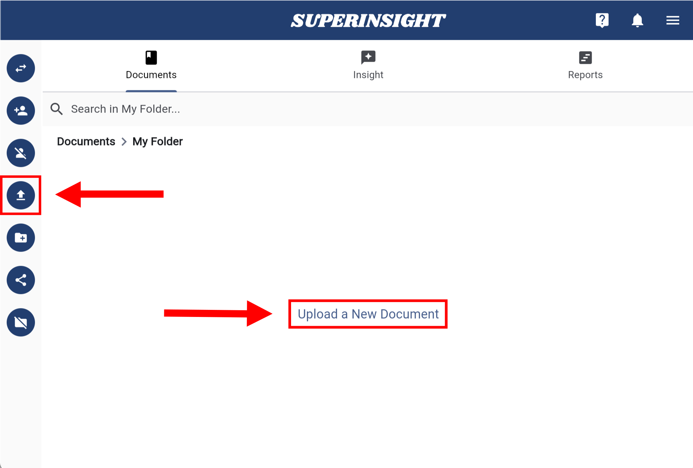

# Quickstart

This is a quickstart guide on how to use Superinsight.
You will learn how to create your knowledge base of case contacts and how to discover insights from your daily massive and messy documentation even hand-written files like medical reports.

If you don't have an account yet, sign up [for access](https://www.superinsight.ai/trial) here.

## 1. Start a New Case

Build up your case information before everything, the first step is to add your contacts. Simply Fill in your contact's name and assign this contact to your organization, then click **Create**.

=== "New Case"

    

=== "Contact Info"

    

## 2. Upload a File

Depending on the purpose, you can upload files that can help your legal claims to the folders you created or Superinsight prepared and organized for you.

After you upload the file, you can see a little window at the right-down corner of the screen showing your file upload progress.

As the file is uploaded, you will see it in the folder as a gray color and can not be clicked on. Behind the scenes, Superinsight processes all the contents of your file. Depending on how large your files are, this process can take a few minutes to hours.

Once the file is ready, as shown in the screenshots below, you can continue to the next step.

=== "Click to Upload"

    

=== "File Uploading"

    

=== "File In Progress"

    

=== "File Is Ready"

    

## 3. Build Report

Once your files are ready, you can generate a comprehensive report by selecting multiple files. Simply click the "Build Report" button on the left to start building your report.

=== "Build Report"

    

=== "Select Practice Area"

    

=== "Choose Template"

    

=== "Select Files"

    

Once submitted, the report will appear in the "Reports" tab and you can download it when completed.

=== "Report List"

    

## 4. Try More

If you like to learn more advance features, please continue our guide for [How To Guide](guide/index.md)
